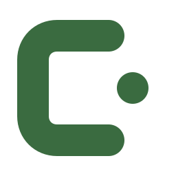

<p align="center">
  
</p>

<h1 align="center">InitPad</h1>

<p align="center">
  <a href="https://github.com/kudrle01/initpad/actions/workflows/ci.yml"></a>
</p>

InitPad je interní vývojářská platforma pro školy, menší týmy a firemní
sandboxy. Z jednoho formuláře připraví soukromý Git repozitář, výchozí kód,
CI pipeline a prostředí `dev → test → prod`. Vývojář tak nemusí pro každý
projekt znovu skládat Docker, CI/CD a základní provozní konfiguraci.

Projekt vzniká jako praktická část diplomové práce na Vysoké škole ekonomické
v Praze. Cílem není nahradit Kubernetes nebo velké platform-engineering
produkty. InitPad zkoumá, jak lze jejich hlavní principy zpřístupnit v menším,
srozumitelném a samostatně nasaditelném systému.

## Stav projektu

| Část | Stav |
|---|---|
| Self-hosted platforma | Veřejný podepsaný release `0.2.0`; funkční single-node profil, probíhá finální ověření na čistém hostu |
| InitPad Agent | Doporučený release `0.14.2`; podepsaná multiarch image prošla distribučním a runtime auditem i živým updatem a rollbackem |
| Hosted SaaS | Ve vývoji; nejde zatím o produkční deployment profil |

Release assets, checksumy a OCI images jsou veřejné a ověřitelné bez GitHub
credentials. Aktuální omezení a podmínky produkčního použití jsou v
[release readiness](docs/RELEASE_READINESS.md).

## Hlavní funkce

- registraci nebo administrátorem spravované účty;
- osobní a týmové workspaces s rolemi;
- založení projektu ze dvanácti udržovaných šablon;
- import existujícího repozitáře;
- automatický build, test a nasazení do dev;
- povýšení stejného buildu do testu a produ;
- Docker targety připojené přes InitPad Agent a kompatibilní SFTP hosting pro
  statické a PHP aplikace;
- bezpečný outbound enrollment, heartbeat a obnovitelné Agent joby bez
  příchozího SSH nebo obecného vzdáleného shellu;
- historii commitů, CI jobů a deployment operací;
- produkční approval, rollback a bezpečné odstranění deploymentu i projektu.

Self-hosted edice používá vestavěnou Giteu, Gitea Actions a privátní OCI
registry. GitHub varianta umí přihlášení, instalaci GitHub App, založení nebo
import repozitáře a převzetí ověřeného Actions artefaktu. Produkční gateway
režim poskytuje stabilní HTTPS adresu a health-gated přepnutí s rollbackem.
Původní source-based SSH runtime je pouze migrační legacy konektor: existující
deploymenty lze dál spravovat, ale nové servery ani prostředí se na něj
nevážou.

## Rychlé spuštění

Jediným požadavkem je Docker s Compose pluginem:

```bash
git clone https://github.com/kudrle01/initpad.git initpad
cd initpad/deploy
./install.sh
```

Po dokončení otevři:

- InitPad: <http://localhost:8080>
- Gitea: <http://gitea.localhost:3001>

Instalátor vygeneruje lokální secrety, spustí databázi a služby, aplikuje
migrace, nastaví SSO a zaregistruje izolovaný CI runner. Je idempotentní, takže
slouží i pro aktualizaci existující instalace. Současně zvolí auditovaný
Agent release; vzdálený Docker server pak správce připojí jediným příkazem
z dialogu **Infrastructure → Manage Agent**, bez instalace Node.js, `make` nebo
klonování repozitáře na cílový server.

Výchozí object storage je lokální kompatibilní služba určená pro vývoj a
důvěryhodné single-node instalace. Veřejná produkce musí použít samostatně
udržované S3-compatible úložiště; konkrétní provozní hranice popisuje
[deploy/OPERATIONS.md](deploy/OPERATIONS.md#object-storage-produkční-hranice).

První ověření je jednoduché: vytvoř účet, založ projekt, otevři jeho CI
pipeline a počkej na dev URL. Podrobné nasazení na server, DNS a HTTPS popisuje
[deploy/README.md](deploy/README.md).

## Projektové šablony

| Ekosystém | Šablony |
|---|---|
| JavaScript / TypeScript | Express, NestJS, Next.js, React + Vite, Vue + Vite |
| Python | Django, FastAPI, Flask |
| PHP | PHP, Laravel, Nette, Symfony |

Každá šablona obsahuje zamčený aplikační dependency lockfile, Dockerfile,
health endpoint a CI workflow. PHP frameworky mají verzovaný skeleton i
`composer.lock`; framework se negeneruje až během deploymentu.

## Lokální vývoj

Požadavky: Node.js 22.12+ a Docker.

```bash
npm ci
docker compose -f infra/docker-compose.yml up -d postgres gitea
cp apps/api/.env.example apps/api/.env
npm run db:migrate --workspace @initpad/api
npm run dev:api
```

Ve druhém terminálu:

```bash
npm run dev:web
```

Web běží na <http://localhost:5173>, API na
<http://localhost:3000/api>. Vývojový stack v `infra/` a kompletní stack v
`deploy/` nespouštěj současně; záměrně sdílejí Compose project name.

## Kontrola změn

```bash
npm run check:release
docker compose -f deploy/docker-compose.yml --profile runner config --quiet
```

`npm run check` je offline gate pro každou změnu: hlídá nechtěné soubory,
lokální cesty a tokeny, osiřelé produkční moduly, sestavení i testy.
`check:release` navíc porovná produkční závislosti s aktuální databází
zranitelností, a proto vyžaduje přístup k internetu.

Anonymní distribuční hranici vydané platformy lze zopakovat příkazem:

```bash
npm run audit:public-release -- --tag initpad-v0.2.0
npm run audit:public-release -- --tag agent-v0.14.2
```

Změna šablony nebo kontejnerové image navíc spouští samostatný GitHub Actions
gate, který sestaví platformu, vyrenderuje všech dvanáct šablon, ověří jejich
test target, non-root runtime a health endpoint. Lokálně lze stejný test spustit
pro vybrané šablony například přes
`./scripts/test-template-images.sh nette laravel symfony`; stáhne a sestaví
image, takže vyžaduje Docker, síť a dostatek volného místa.

## Důležité omezení

Self-hosted profil je single-node systém určený pro důvěryhodnou organizaci.
Workspace RBAC odděluje data aplikace, ale není bezpečnostní hranicí proti
škodlivému workloadu na sdíleném Docker hostu. Tento profil proto bez další
izolace nevystavuj jako nepřátelský multi-tenant SaaS. Podrobnosti jsou v
[THREAT_MODEL.md](THREAT_MODEL.md).

## Dokumentace

- [docs/ARCHITECTURE.md](docs/ARCHITECTURE.md) — skutečné komponenty a datové
  toky;
- [docs/RELEASE_READINESS.md](docs/RELEASE_READINESS.md) — známá omezení a
  podmínky vydání;
- [docs/EVALUATION.md](docs/EVALUATION.md) — nezávislý uživatelský test;
- [deploy/README.md](deploy/README.md) — instalace;
- [deploy/OPERATIONS.md](deploy/OPERATIONS.md) — provoz, zálohy a obnova;
- [deploy/SELF_HOSTED_ACCEPTANCE.md](deploy/SELF_HOSTED_ACCEPTANCE.md) — živé ověření;
- [apps/agent/README.md](apps/agent/README.md) — izolovaný Agent lab;
- [apps/agent/RELEASING.md](apps/agent/RELEASING.md) — vydání a ověření Agenta;
- [PRODUCT_ROADMAP.md](PRODUCT_ROADMAP.md) — stav a další milníky;
- [DECISIONS.md](DECISIONS.md) — architektonická rozhodnutí;
- [THREAT_MODEL.md](THREAT_MODEL.md) — hranice důvěry a produkční podmínky.

## Autor, licence a přispívání

Projekt zpracovává Jan Kudrlička jako praktickou část diplomové práce na
Vysoké škole ekonomické v Praze. Repozitář slouží jako reprodukovatelný
implementační artefakt; tvrzení o funkčnosti se vztahují ke konkrétním
releaseům a zdokumentovaným acceptance testům.

InitPad je dostupný pod [Apache License 2.0](LICENSE). Postup pro lokální vývoj,
testy a pull requesty je v [CONTRIBUTING.md](CONTRIBUTING.md).
Bezpečnostní problémy se nehlásí veřejným issue; použij
[SECURITY.md](SECURITY.md). Copyright © 2026 Jan Kudrlička.
