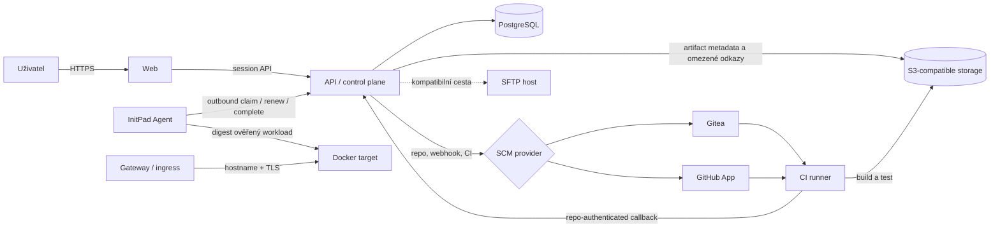
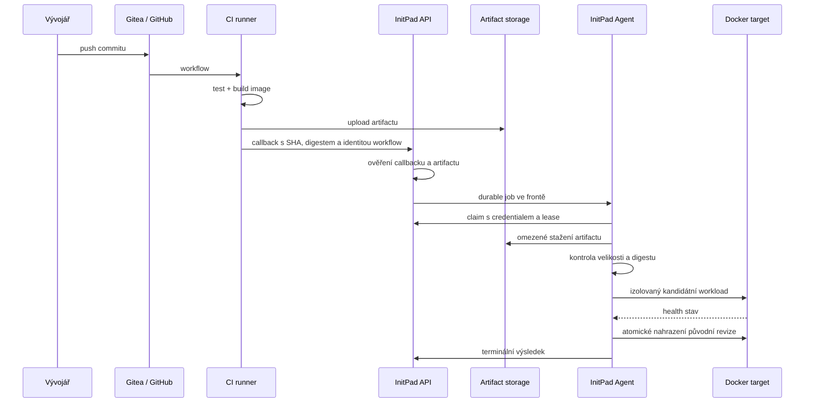

# Architektura InitPadu

Tento dokument popisuje aktuální implementaci, ne zamýšlený koncový stav.
Rozhodnutí a jejich důvody jsou v [`DECISIONS.md`](../DECISIONS.md), provozní
postupy v [`deploy/OPERATIONS.md`](../deploy/OPERATIONS.md) a dosud otevřené
hranice v [`RELEASE_READINESS.md`](./RELEASE_READINESS.md).

## Dvě edice, stejný doménový model

| Oblast | Self-hosted | Veřejný SaaS |
|---|---|---|
| Zdrojový kód a CI | vestavěná Gitea + Actions | GitHub + GitHub App |
| Přihlášení | heslo, InitPad SSO do Gitey | GitHub OAuth |
| Docker target | InitPad Agent; vestavěný Docker jen v této edici | InitPad Agent |
| Sdílený PHP/static hosting | SFTP compatibility target | pouze veřejně dosažitelný SFTP target |
| Artifact storage | vestavěný store pro důvěryhodný single-node provoz nebo externí S3 | externí S3-compatible služba |
| Stav | funkční a živě ověřený profil | implementované SCM základy; produkční profil ještě není vydaný |

Workspace, role, projekty, artifacty, approvals a audit mají v obou edicích
stejný význam. Provider se mění na hranici SCM a deployment targetu, ne
uvnitř doménového modelu.

## Přehled komponent

Control plane nepotřebuje příchozí SSH ani Docker API vzdáleného serveru.
Agent navazuje odchozí HTTPS spojení a dostává pouze typované operace;
neobsahuje obecný vzdálený shell.

## Hlavní doménové objekty

- **Workspace** je bezpečnostní a organizační hranice. Členství nese roli
  `viewer`, `member`, `admin` nebo `owner`.
- **Project** odkazuje na repozitář pomocí providera a immutable repository
  identity. Zobrazené jméno ani URL nejsou identitou repozitáře.
- **Target** popisuje fyzický server nebo hosting a jeho management provider.
- **TargetAllocation** přiděluje konkrétnímu workspace omezený přístup na
  target: namespace, povolená prostředí, kapacitu a resource limity.
- **BuildArtifact** je neměnný výsledek CI svázaný se SHA a digestem.
- **DeploymentOperation** je trvalý záznam požadované změny prostředí.
- **AgentJob** je lease-fenced dílčí práce pro jeden Agent target.
- **AuditEvent** je append-only záznam aktéra, akce, resource a výsledku.

Target a allocation jsou záměrně oddělené. Jeden fyzický server tak může
bez sdílení credentials obsloužit více workspace, z nichž každý má vlastní
namespace, kvótu a síťovou projekci.

## Tok od commitu k nasazení

Do `test` a `prod` se nepřekládá zdrojový kód znovu. Promotion používá
stejné SHA a digest, které prošly předchozím prostředím. Produkce navíc
prochází approval workflow; team workspace ve výchozím stavu vyžaduje
jiného schvalovatele.

## Provisioning projektu

Při založení projektu API vytvoří durable provisioning operation. Generátor
vyrenderuje zvolenou verzovanou šablonu, SCM provider založí soukromý
repozitář a zapíše první commit. Import existujícího repozitáře naopak jeho
kód bez explicitního souhlasu nemění. Chybějící deployment kontrakt se
nejprve zobrazí jako preflight problém.

Provisioning je omezený na jedno repo, ale není globálně serializovaný.
Více projektů může vznikat současně; CI runner používá viditelnou frontu a
nastavenou kapacitu, aby náročné buildy nezablokovaly control plane.

## Agent a vzdálený Docker

1. Owner nebo admin vytvoří Agent target a jednorázový enrollment token.
2. Správce targetu spustí ověřený instalátor na Docker serveru. Token se
   zadá skrytě a neukládá se do shell history.
3. Agent token jednou vymění za vlastní credential a poté posílá heartbeat.
4. Claim jobu je vázaný na target, credential generation, lease ownera,
   hashovaný fencing token a expiraci.
5. Při ztrátě lease Agent zastaví lokální práci. Pozdní nebo cizí completion
   control plane odmítne.
6. Disconnect nebo Retire zruší management trust, ale nemaže workloady.
   Odstranění prostředí je samostatná explicitní operace.

Workloady nesou labels s workspace namespace, projektem, prostředím, revizí
a Agent jobem. Agent smí spravovat jen kontejnery označené InitPadem a uvnitř
přidělené allocation.

## Stabilní adresy aplikací

Přímý lokální režim publikuje náhodný port. Produkční gateway režim
přidělí prostředí stabilní hostname, ukončí TLS a přepne route až po
úspěšném health checku kandidáta. DNS wildcard a důvěryhodný certifikát
zajišťuje provozovatel infrastruktury; samotné vyplnění domény v InitPadu
veřejný DNS záznam nevytvoří.

## Data a zdroje pravdy

| Data | Zdroj pravdy |
|---|---|
| Účty, workspace, role, projekty a operace | PostgreSQL |
| Zdrojový kód a historie commitů | zvolený SCM provider |
| Ověřené build artifacty | privátní S3-compatible storage |
| Běžící workload | Docker target; databáze drží požadovanou a naposledy pozorovanou projekci |
| Uživatelská bezpečnostní historie | `AuditEvent` v PostgreSQL |
| Provozní diagnostika | strukturované API/Agent logy |

Audit log, deployment timeline a provozní log jsou rozdílné vrstvy.
Audit odpovídá na „kdo změnu vyžádal“, operace na „v jakém stavu je“ a
strukturovaný log na „kde se provádění porouchalo“. `correlationId` spojuje
HTTP request, deployment operation a Agent job; kontejner nese odpovídající
`com.initpad.job` label.

## Recovery a konzistence

- Rozpracované provisioning, deployment a Agent joby jsou uložené v databázi.
- Lease a compare-and-set přechody chrání před dvojím dokončením operace.
- Nezdravý kandidát nenahradí poslední zdravou revizi.
- Restore zálohy zneplatní runtime projekce a staré lease; vzdálené workloady
  automaticky nemaže.
- Smazání projektu nejprve uklidí deploymenty a artifacty. Nedokončený
  vzdálený cleanup zůstane viditelný jako dluh nebo explicitní detach, aby se
  databáze netvářila, že vzdálené prostředky neexistují.

## Bezpečnostní hranice

Self-hosted RBAC odděluje data a běžné operace spolupracujících týmů. Sdílený
Docker daemon však není izolace proti útočníkovi, který může dodat škodlivý
workload. Pro takový multi-tenant provoz je potřeba samostatný host, VM nebo
silnější runtime sandbox pro každou důvěryhodnostní zónu. Detailní model
hrozeb je v [`THREAT_MODEL.md`](../THREAT_MODEL.md).
